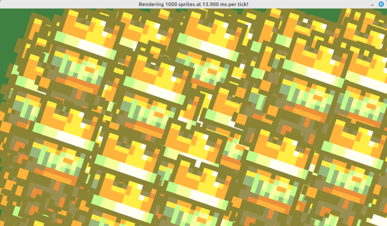

# Pygame Render

Python package for rendering 2D graphics with shaders in Pygame.



## System requirements

- `Python` version >= 3.10
- `OpenGL` version >= 3.3

## Supported platforms

✅ **Windows**  
✅ **Mac**  
✅ **Linux**  

## Installation

Firstly, ensure that your system meets the [System requirements](#system-requirements).

Then, run the following command:

```sh
python3 -m pip install pygame-render
```

To verify correct installation, open a Python terminal and import the module:

```py
import pygame_render
```

If there are no errors, the installation was successful!

## Getting started

To learn about the features of `pygame-render`, check out the [Feature Walkthrough](https://github.com/MarkelZ/pygame_render/wiki/Feature-Walkthrough) page on the wiki.

You can also take a look at the examples in the [`examples/`](https://github.com/MarkelZ/pygame_render/tree/main/examples) directory.

For detailed explanations of the API, please refer to the [API Reference](https://github.com/MarkelZ/pygame-render/wiki/API-Reference).

Tutorial video: https://youtu.be/mlm66OJZaA0

## Python package dependencies

These packages will be automatically installed by `pip` along with `pygame-render`:
- `numpy` >=1.22.0
- `pygame` >=2.1.0
- `moderngl` >= 5.8.2
- `PyOpenGL` >= 3.1.6

## Frequently Asked Questions

For frequently asked questions, check out [FAQ](https://github.com/MarkelZ/pygame-render/wiki/FAQ).

## Contributing

We greatly appreciate and encourage contributions from the community! 

If you want to report a bug or request a new feature, feel free to open an issue in the [issue tracker](https://github.com/MarkelZ/pygame-render/issues).

For code contributions, please check out [Contributing](https://github.com/MarkelZ/pygame_render/wiki/Contributing) for details.

## License

This code is licensed under the terms of the MIT license.
